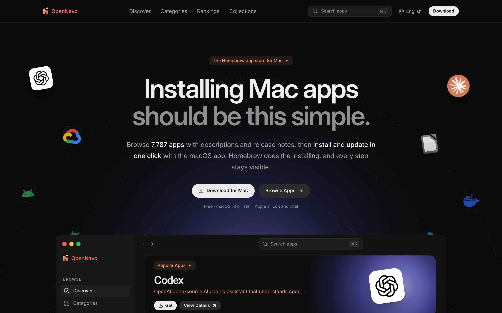
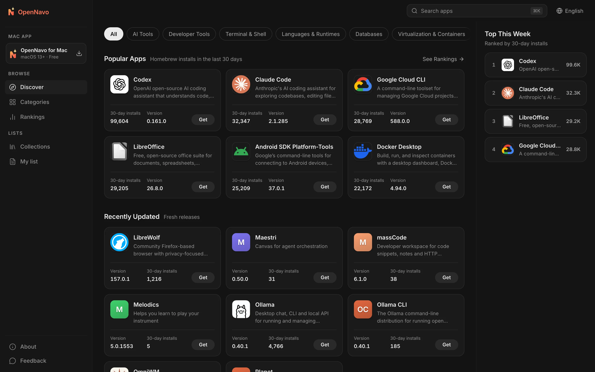
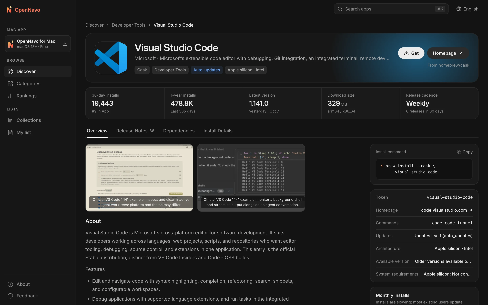
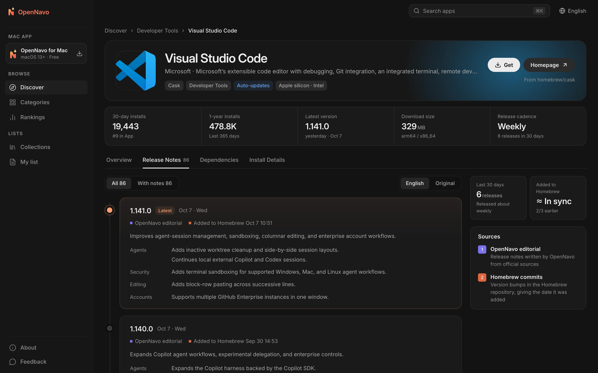

<div align="center">


# OpenNavo

**English** · [简体中文](docs/i18n/README.zh-CN.md) · [日本語](docs/i18n/README.ja-JP.md) · [Español](docs/i18n/README.es-ES.md) · [Português (Brasil)](docs/i18n/README.pt-BR.md) · [Русский](docs/i18n/README.ru-RU.md)

**The Homebrew app store for Mac**

Explore descriptions and release notes for over 7,700 Homebrew Casks,<br>
then install and update in one click with the macOS app. Homebrew handles every step, and every step stays visible.

[](LICENSE)


[Website](https://opennavo.com/) · [Browse Apps](https://opennavo.com/discover) · [Download](https://opennavo.com/download) · [Contributing](#contributing)



</div>

## Introduction

Homebrew is a reliable way to install software on a Mac, but the command line isn't for everyone, and `brew outdated` won't tell you what changed. OpenNavo gives Homebrew Cask an app store interface:

- **Web**: Browse, search, and compare apps, read release notes for each version, and copy installation commands.
- **macOS app**: Everything available on the web, plus installation, updates, and uninstallation through Homebrew on your own Mac, with a record of every operation.
- **Six languages**: English, 简体中文, 日本語, Español, Português (Brasil), and Русский. The interface is fully localized; app descriptions and release notes are translated automatically, with the original text always available.
- **No account required**: No sign-up or login. Just open it and start browsing.

[opennavo.com](https://opennavo.com/) runs the code in this repository.

## Features

### Web

- **Discover**: Categories, rankings based on real installation counts, editorial picks, and collections.
- **Search**: English and Chinese names, pinyin, and aliases. For example, `weixin` finds WeChat, and `vscode` finds Visual Studio Code. Press <kbd>⌘</kbd> <kbd>K</kbd> from anywhere.
- **App details**: Descriptions, screenshots, installation counts and release cadence, dependencies and conflicts, installation paths, and uninstall behavior.
- **Release notes**: A timeline of each version's changes, with the date it was added to Homebrew and a switch between translations and the original.
- **Brewfile**: Add apps to your list while browsing and generate a Brewfile in one click. Collections can also be exported directly.
- **Open in the app**: Hand installation over to the macOS app through `opennavo://` deep links.

### macOS app

- **Install, update, and uninstall in one click**: Tasks run in a queue with live progress and the actual brew commands. Inspect logs and retry when a task fails.
- **Update management**: Scheduled checks and one-click updates for all apps, with support for apps that update themselves (`auto_updates`) and pinned apps. You'll be asked for permission before updating an app that's running.
- **Local activity**: Every installation, update, and uninstallation is recorded and can be exported.
- **Get started easily**: Detect your Homebrew environment and get help installing it. Switch between mirrors in China with one click: Tsinghua TUNA, USTC, and Alibaba Cloud.
- **More**: A menu bar app, Brewfile import and export, an offline catalog, and updates for OpenNavo itself.

### Admin and content management

- Manage categories, text in six languages, icons and accent colors, screenshots, editorial picks, collections, terminology, and client announcements.
- Manage release notes and translations, sync jobs, search insights, feedback, client releases, mirrors, and remote configuration. Includes administrators, roles and permissions, and audit logs. Changes can be restored; deleted items go to a recycle bin first.
- Built-in [MCP](https://modelcontextprotocol.io) service: AI agents can maintain app content within their granted permissions. All write operations support dry runs.

## Screenshots

<table>
  <tr>
    <td width="50%"></td>
    <td width="50%"></td>
  </tr>
  <tr>
    <td align="center">Discover: categories, popular apps, and recent updates</td>
    <td align="center">Details: descriptions, key stats, and installation commands</td>
  </tr>
  <tr>
    <td colspan="2"></td>
  </tr>
  <tr>
    <td colspan="2" align="center">Release notes: changes in each version and when it was added to Homebrew</td>
  </tr>
</table>

## How the app uses Homebrew

The app runs commands on your computer, so clear safety boundaries come first:

- **The server never runs brew**. Installation, updates, and uninstallation are initiated by the app on your Mac.
- **No shell involved**: brew is called with an argument array. Package names must pass allowlist validation to prevent command injection.
- **Casks only**: Commands targeting a specific app explicitly include `--cask`. Write operations on Formulae are rejected.
- **You're in control**: Any write operation requested through a web deep link requires your confirmation in the app before it runs.
- **No hosting of installers**: Downloads come directly from upstream sources or Homebrew. OpenNavo does not handle the installers themselves.

## Architecture

```text
opennavo/
├── apps/
│   ├── web/                Web app (Nuxt 4 SSR)
│   ├── desktop/            macOS app (Tauri 2 · Vue 3 · Rust)
│   ├── admin/              Admin panel (based on soybean-admin v2.2.0)
│   ├── server/             Go backend: public, admin, and Agent APIs; worker
│   └── mcp/                MCP service (Python · FastMCP), calls only the backend Agent API
├── packages/
│   ├── ui/                 Presentation components shared by web and desktop
│   ├── tokens/             Single source of truth for colors, radii, and type sizes
│   ├── shared/             Locale list, error codes, version comparison, and shared logic
│   └── api/                TypeScript types generated from OpenAPI contracts
├── tooling/
│   ├── scripts/
│   ├── config/
│   └── i18n/
├── ops/                Docker Compose, Caddy, Prometheus / Grafana, backup scripts
├── docs/
│   ├── i18n/
│   ├── security/
│   ├── legal/
│   └── design/
└── .github/
```

The backend syncs the catalog and installation counts from Homebrew's public APIs, reads Homebrew commits to find when each version was added, probes download sizes, and generates offline catalog snapshots for the app. APIs follow a contract-first workflow: update `apps/server/api/*.openapi.yaml`, then run `make gen` to generate Go and TypeScript code.

| Part | Technology |
|---|---|
| Web | Nuxt 4 · Vue 3 · UnoCSS (SSR) |
| macOS app | Tauri 2 · Vue 3 · Rust · SQLite (FTS5) |
| Admin | soybean-admin v2.2.0 · Vue 3 · Naive UI |
| Backend | Go · Gin · GORM · PostgreSQL 18 · Redis 8 · asynq · S3-compatible storage (MinIO) |
| MCP | Python 3.13 · FastMCP · uv |
| Contracts and generation | OpenAPI 3.0.3 · oapi-codegen · openapi-typescript · tauri-specta |

## Quick start

### Requirements

- Node.js 24 and pnpm 10
- Go 1.27 and Rust 1.96.0 (the exact Rust toolchain is pinned in `apps/desktop/src-tauri/rust-toolchain.toml`)
- Python 3.13 and [uv](https://docs.astral.sh/uv/) (MCP)
- Docker (local PostgreSQL, Redis, and MinIO)
- macOS 13 or later (desktop app only)

### Run locally

```sh
# Check the toolchain and install dependencies
make setup

# Start local infrastructure, run migrations, and load seed data
make infra migrate seed

# Sync the catalog from Homebrew's public API (requires network access)
node tooling/scripts/tasks/server.mjs catalog-sync

# Run each in a separate terminal
make dev-api           # Public and admin APIs    http://localhost:8080
make dev-worker        # Worker: sync, translation, snapshots
make dev-web           # Web app                  http://localhost:3000
make dev-admin         # Admin panel              http://localhost:9527
make dev-desktop       # macOS app (Tauri)
```

The local admin credentials come from `ADMIN_BOOTSTRAP_USERNAME` / `ADMIN_BOOTSTRAP_PASSWORD` in `apps/server/.env.example` and are for development only. Run `make help` for all available commands.

For frontend-only work, you can use mocks without starting the backend: `make mock` serves Prism mocks from the OpenAPI contracts (public API on 4010, admin API on 4011). Start the frontend with `MOCK=1 make dev-web` or `MOCK=1 make dev-admin`. `make dev-desktop-web` runs the desktop interface in a browser, replacing system calls with mocks.

### Configuration

- `apps/server/.env.example` lists all backend environment variables and local defaults. Put local secrets, such as API keys, in the Git-ignored `apps/server/.env.local`; the backend reads it automatically at startup. Explicit process environment takes precedence over `.env.local`, which takes precedence over nonempty `.env.example` defaults in development commands.
- Content translation is disabled by default. Enable it in **System → Translation AI Settings** in the admin panel by entering the URL, key, and model for any OpenAI-compatible API. If the admin settings are not configured, the backend falls back to `LLM_BASE_URL` (default: `https://api.openai.com/v1`), `LLM_API_KEY`, and `LLM_MODEL`.
- When `APP_ENV` is `staging` or `prod`, the backend rejects the example secrets in `.env.example` to prevent deployment with public defaults.

### Tests

```sh
make lint test
```

Includes OpenAPI validation, static checks and unit tests for Go / TypeScript / Rust / Python, and completeness checks for all six interface languages. Browser end-to-end tests are available through `make e2e`.

> [!IMPORTANT]
> During development and testing, do not actually run `brew install`, `upgrade`, `uninstall`, `cleanup`, or `update` on your computer. Test desktop write operations with the fake brew by setting `OPENNAVO_BREW_PATH` to `apps/desktop/src-tauri/tests/fake-brew/brew`.

## Deployment

Production deployment starts with `ops/docker-compose.prod.yml`: two API replicas, two web replicas, a worker, Redis, and Caddy. PostgreSQL (`local-db`), Prometheus / Grafana / asynqmon (`monitoring`), and daily backups (`backup`) are enabled through optional profiles.

Follow the [deployment guide](ops/GUIDE.md) for copyable image builds, external `COMPOSE_ENV_FILES`, database and S3 initialization, backup/restore, profiles, and upgrades.

## Contributing

Issues and pull requests are welcome. See [CONTRIBUTING.md](.github/CONTRIBUTING.md) for the complete workflow. Before you start:

- **Contracts first**: Change `apps/server/api/*.openapi.yaml` before implementation and run `make gen`. Do not edit generated files by hand.
- **Design tokens**: Use `packages/tokens/tokens.json` for colors, radii, and other tokens. Do not hardcode colors in components.
- **Database**: Add new migration files; do not modify existing migrations.
- **Text**: Put all user-facing text in locale files and provide all six languages. `make lint` checks completeness.
- **Commit messages**: Follow [Conventional Commits](https://www.conventionalcommits.org/en/), for example `feat(desktop): …` or `fix(server): …`.
- Ensure `make lint test` passes before committing.

## Security

Report vulnerabilities privately to **admin@opennavo.com**. See [SECURITY.md](.github/SECURITY.md) for supported versions and the optional GitHub private reporting channel. Do not open a public vulnerability issue.

## License

This project is open source under the [Apache License 2.0](LICENSE). Third-party notices are in [NOTICE](NOTICE); dependency evidence and distribution instructions are in [THIRD_PARTY.md](docs/legal/THIRD_PARTY.md).

The OpenNavo name and logo are not covered by this license. When distributing a modified version, use a different name and icon, and replace the app's Bundle ID, updater public key, and update URL. Homebrew is a trademark of the Homebrew project; OpenNavo is not affiliated with Homebrew. App names and icons belong to their respective owners.
