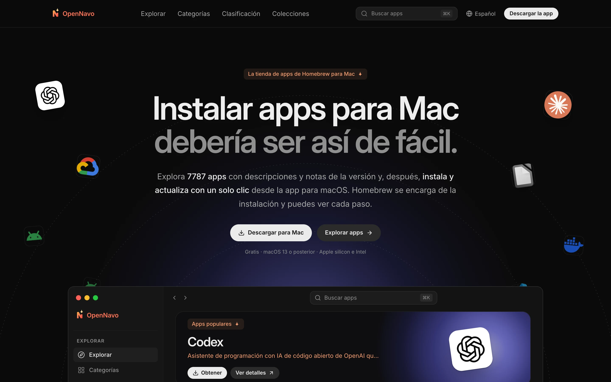
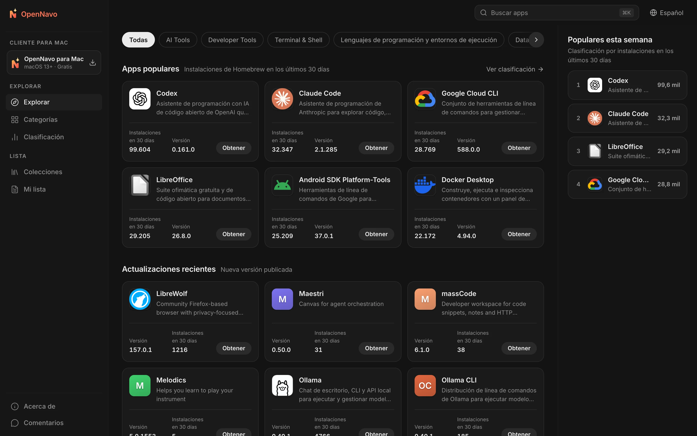
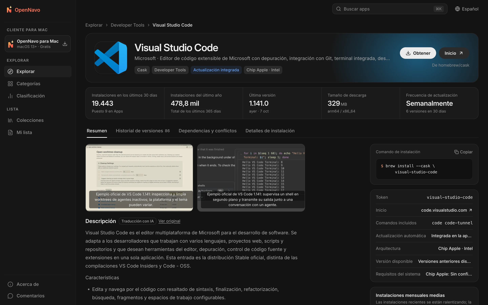
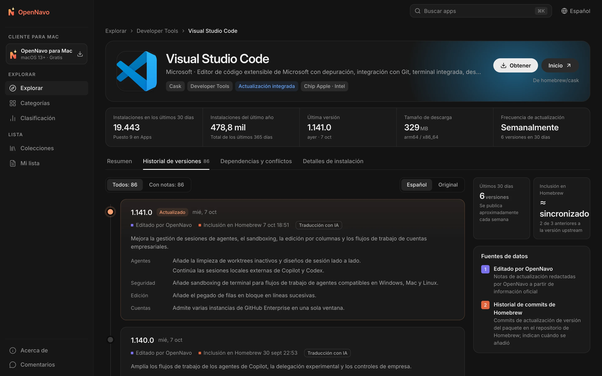

<div align="center">


# OpenNavo

[English](../../README.md) · [简体中文](README.zh-CN.md) · [日本語](README.ja-JP.md) · **Español** · [Português (Brasil)](README.pt-BR.md) · [Русский](README.ru-RU.md)

**La tienda de apps de Homebrew para Mac**

Explora las descripciones y notas de versión de más de 7.700 Homebrew Casks,<br>
e instala y actualiza con un clic desde la app para macOS. Homebrew se encarga de cada paso y puedes seguir todo el proceso.

[](../../LICENSE)


[Sitio web](https://opennavo.com/es) · [Explorar apps](https://opennavo.com/es/discover) · [Descargar](https://opennavo.com/es/download) · [Contribuir](#contribuir)



</div>

## Introducción

Homebrew es una forma fiable de instalar software en Mac, pero la línea de comandos no resulta cómoda para todo el mundo y `brew outdated` no explica qué ha cambiado. OpenNavo ofrece una interfaz de tienda de apps para Homebrew Cask:

- **Web**: Navega, busca y compara apps, consulta las notas de cada versión y copia los comandos de instalación.
- **App para macOS**: Todas las funciones de la web, además de instalar, actualizar y desinstalar mediante el Homebrew de tu Mac, con un registro de cada operación.
- **Seis idiomas**: English, 简体中文, 日本語, Español, Português (Brasil) y Русский. Toda la interfaz está localizada; las descripciones y notas de versión se traducen automáticamente y siempre puedes consultar el original.
- **Sin cuenta**: No hace falta registrarse ni iniciar sesión. Abre la app y empieza a usarla.

[opennavo.com](https://opennavo.com/es) funciona con el código de este repositorio.

## Funciones

### Web

- **Descubrir**: Categorías, rankings basados en instalaciones reales, selecciones editoriales y colecciones.
- **Buscar**: Nombres en inglés y chino, pinyin y alias. Por ejemplo, `weixin` encuentra WeChat y `vscode` encuentra Visual Studio Code. Pulsa <kbd>⌘</kbd> <kbd>K</kbd> en cualquier momento.
- **Detalles de las apps**: Descripciones, capturas, instalaciones y frecuencia de actualización, dependencias y conflictos, rutas de instalación y comportamiento al desinstalar.
- **Notas de versión**: Una cronología de los cambios de cada versión, con la fecha de incorporación a Homebrew y la opción de alternar entre la traducción y el original.
- **Brewfile**: Añade apps a tu lista mientras navegas y genera un Brewfile con un clic. También puedes exportar colecciones directamente.
- **Abrir en la app**: Transfiere la instalación a la app para macOS mediante enlaces profundos `opennavo://`.

### App para macOS

- **Instala, actualiza y desinstala con un clic**: Las tareas se ejecutan en cola y muestran el progreso y los comandos brew reales. Si fallan, puedes consultar los registros y reintentarlas.
- **Gestión de actualizaciones**: Comprobaciones periódicas y actualización de todas las apps con un clic. Reconoce las apps que se actualizan solas (`auto_updates`) y las fijadas (pinned). Pide permiso antes de actualizar una app en ejecución.
- **Historial local**: Registra cada instalación, actualización y desinstalación, y permite exportar el historial.
- **Configuración sencilla**: Detecta el entorno de Homebrew y te guía para instalarlo. Puedes cambiar con un clic entre mirrors en China: Tsinghua TUNA, USTC y Alibaba Cloud.
- **Más funciones**: App en la barra de menús, importación y exportación de Brewfile, catálogo sin conexión y actualizaciones de OpenNavo.

### Administración y gestión de contenidos

- Gestiona categorías, textos en seis idiomas, iconos y colores de acento, capturas, selecciones editoriales, colecciones, glosarios y anuncios del cliente.
- Gestiona notas de versión y traducciones, tareas de sincronización, análisis de búsquedas, comentarios, versiones del cliente, mirrors y configuración remota. Incluye administradores, roles, permisos y registros de auditoría. Los cambios se pueden restaurar y los elementos eliminados pasan primero por la papelera.
- Servicio [MCP](https://modelcontextprotocol.io) integrado: los agentes de IA pueden mantener el contenido de las apps dentro de los permisos concedidos. Todas las operaciones de escritura admiten simulación (dry run).

## Capturas de pantalla

<table>
  <tr>
    <td width="50%"></td>
    <td width="50%"></td>
  </tr>
  <tr>
    <td align="center">Descubrir: categorías, apps populares y actualizaciones recientes</td>
    <td align="center">Detalles: descripción, datos clave y comandos de instalación</td>
  </tr>
  <tr>
    <td colspan="2"></td>
  </tr>
  <tr>
    <td colspan="2" align="center">Notas de versión: cambios de cada versión y fecha de incorporación a Homebrew</td>
  </tr>
</table>

## Cómo utiliza Homebrew la app

La app ejecuta comandos en tu ordenador, por lo que unos límites claros de seguridad son la prioridad del diseño:

- **El servidor nunca ejecuta brew**. La app de tu Mac inicia las instalaciones, actualizaciones y desinstalaciones.
- **Sin pasar por un shell**: brew se invoca mediante un array de argumentos. Los nombres de paquetes se validan con una lista de permitidos para impedir la inyección de comandos.
- **Solo Cask**: Los comandos dirigidos a una app concreta incluyen explícitamente `--cask`. Se rechazan las operaciones de escritura sobre Formula.
- **Tú decides**: Cualquier operación de escritura solicitada desde un enlace profundo de la web requiere tu confirmación en la app antes de ejecutarse.
- **Sin alojar instaladores**: Las descargas siempre proceden del proveedor original o de Homebrew. OpenNavo no gestiona los propios instaladores.

## Arquitectura

```text
opennavo/
├── apps/
│   ├── web/                App web (Nuxt 4 SSR)
│   ├── desktop/            App para macOS (Tauri 2 · Vue 3 · Rust)
│   ├── admin/              Panel de administración (soybean-admin v2.2.0)
│   ├── server/             Backend Go: API pública, de administración y de agentes; worker
│   └── mcp/                Servicio MCP (Python · FastMCP), solo llama a la API de agentes del backend
├── packages/
│   ├── ui/                 Componentes de presentación compartidos por web y escritorio
│   ├── tokens/             Fuente única para colores, radios y tamaños de texto
│   ├── shared/             Idiomas, códigos de error, comparación de versiones y lógica común
│   └── api/                Tipos TypeScript generados a partir de los contratos OpenAPI
├── tooling/
│   ├── scripts/
│   ├── config/
│   └── i18n/
├── ops/                Docker Compose, Caddy, Prometheus / Grafana y scripts de copia de seguridad
├── docs/
│   ├── i18n/
│   ├── security/
│   ├── legal/
│   └── design/
└── .github/
```

El backend sincroniza el catálogo y las cifras de instalaciones desde las API públicas de Homebrew, consulta sus commits para conocer la fecha de incorporación de cada versión, comprueba los tamaños de descarga y genera instantáneas del catálogo para el uso sin conexión. Las API siguen un flujo basado en contratos: primero se modifica `apps/server/api/*.openapi.yaml` y después `make gen` genera el código Go y TypeScript.

| Parte | Tecnología |
|---|---|
| Web | Nuxt 4 · Vue 3 · UnoCSS (SSR) |
| App para macOS | Tauri 2 · Vue 3 · Rust · SQLite (FTS5) |
| Administración | soybean-admin v2.2.0 · Vue 3 · Naive UI |
| Backend | Go · Gin · GORM · PostgreSQL 18 · Redis 8 · asynq · almacenamiento compatible con S3 (MinIO) |
| MCP | Python 3.13 · FastMCP · uv |
| Contratos y generación | OpenAPI 3.0.3 · oapi-codegen · openapi-typescript · tauri-specta |

## Inicio rápido

### Requisitos

- Node.js 24 y pnpm 10
- Go 1.27 y Rust 1.96
- Python 3.13 y [uv](https://docs.astral.sh/uv/) (MCP)
- Docker (PostgreSQL, Redis y MinIO locales)
- macOS 13 o posterior (solo para la app de escritorio)

### Ejecutar en local

```sh
# Comprobar las herramientas e instalar dependencias
make setup

# Iniciar la infraestructura local, ejecutar migraciones y cargar datos iniciales
make infra migrate seed

# Sincronizar el catálogo desde la API pública de Homebrew (requiere conexión)
node tooling/scripts/tasks/server.mjs catalog-sync

# Ejecutar cada comando en un terminal distinto
make dev-api           # API pública y de administración    http://localhost:8080
make dev-worker        # Worker: sincronización, traducción e instantáneas
make dev-web           # App web                            http://localhost:3000
make dev-admin         # Panel de administración            http://localhost:9527
make dev-desktop       # App para macOS (Tauri)
```

Las credenciales del administrador local se configuran mediante `ADMIN_BOOTSTRAP_USERNAME` / `ADMIN_BOOTSTRAP_PASSWORD` en `apps/server/.env.example` y solo sirven para desarrollo. Ejecuta `make help` para ver todos los comandos.

Si solo modificas el frontend, puedes trabajar sin iniciar el backend: `make mock` ofrece API simuladas con Prism a partir de los contratos OpenAPI (pública en 4010, administración en 4011). Después ejecuta `MOCK=1 make dev-web` o `MOCK=1 make dev-admin`. `make dev-desktop-web` ejecuta la interfaz de escritorio en un navegador y sustituye las llamadas al sistema por simulaciones.

### Configuración

- `apps/server/.env.example` enumera las variables de entorno del backend y sus valores locales por defecto. Guarda los secretos locales, como las claves de API, en `apps/server/.env.local`, que Git ignora; el backend lo lee automáticamente al arrancar.
- La traducción de contenidos está desactivada por defecto. Actívala desde **Sistema → Configuración de IA de traducción** en el panel de administración, indicando la URL, clave y modelo de una API compatible con OpenAI. Si el panel no está configurado, se usan las variables `LLM_BASE_URL` (por defecto, `https://api.openai.com/v1`), `LLM_API_KEY` y `LLM_MODEL`.
- Cuando `APP_ENV` es `staging` o `prod`, el backend rechaza los secretos de ejemplo de `.env.example` para impedir un despliegue con valores públicos por defecto.

### Pruebas

```sh
make lint test
```

Incluye validación de OpenAPI, análisis estático y pruebas unitarias de Go / TypeScript / Rust / Python, y comprobaciones de integridad de los textos en los seis idiomas. Las pruebas de extremo a extremo del navegador están disponibles con `make e2e`.

> [!IMPORTANT]
> Durante el desarrollo y las pruebas, no ejecutes realmente `brew install`, `upgrade`, `uninstall`, `cleanup` ni `update` en tu ordenador. Prueba las operaciones de escritura del cliente con el brew simulado: configura `OPENNAVO_BREW_PATH` con `apps/desktop/src-tauri/tests/fake-brew/brew`.

## Despliegue

El despliegue de producción parte de `ops/docker-compose.prod.yml`: dos réplicas de la API y dos de la web, un worker, Redis y Caddy. PostgreSQL (`local-db`), Prometheus / Grafana / asynqmon (`monitoring`) y las copias de seguridad diarias (`backup`) se activan mediante perfiles opcionales.

1. Prepara las variables según `ops/.env.example`: dominios, imágenes y secretos de al menos 32 bytes cada uno. Guarda el archivo de entorno fuera del repositorio.
2. Compila o descarga las imágenes: `docker build --target server server` para el backend, `docker build -f apps/web/Dockerfile .` para la web y `pnpm --filter @opennavo/admin build` para los archivos estáticos del panel. Al subir etiquetas `server-v*`, `web-v*` o `mcp-v*`, GitHub Actions compila y publica las imágenes correspondientes.
3. Ejecuta, en este orden, las migraciones (`ops/migrate.sh`), la inicialización del almacenamiento de objetos (`storage-init`) y los datos iniciales (`seed`); después inicia todos los servicios. Cambia la contraseña del administrador inicial inmediatamente después del primer acceso.
4. Para futuras actualizaciones, `ops/rollout.py` sustituye las réplicas de la API de forma gradual. Ejecútalo primero sin opciones para revisar el plan y añade `--apply` para aplicarlo después de confirmarlo.

## Contribuir

Las issues y pull requests son bienvenidas. Antes de empezar:

- **Primero los contratos**: Modifica `apps/server/api/*.openapi.yaml` antes de la implementación y ejecuta `make gen`. No edites a mano los archivos generados.
- **Tokens de diseño**: Usa `packages/tokens/tokens.json` para colores, radios y otros valores. No escribas colores directamente en los componentes.
- **Base de datos**: Añade nuevas migraciones; no modifiques las existentes.
- **Textos**: Todos los textos de la interfaz deben estar en los archivos de idiomas y contar con las seis traducciones. `make lint` comprueba su integridad.
- **Mensajes de commit**: Sigue [Conventional Commits](https://www.conventionalcommits.org/en/), por ejemplo `feat(desktop): …` o `fix(server): …`.
- Comprueba que `make lint test` pasa antes de hacer un commit.

## Seguridad

Si encuentras una vulnerabilidad, comunícala de forma privada desde **Security → Report a vulnerability** en el repositorio, en lugar de abrir una issue pública. Responderemos lo antes posible.

## Licencia

Este proyecto es de código abierto bajo la [Apache License 2.0](../../LICENSE). Los avisos de componentes de terceros están en [NOTICE](../../NOTICE).

El nombre y el logotipo de OpenNavo no están cubiertos por esta licencia. Al distribuir una versión modificada, usa otro nombre e icono y sustituye el Bundle ID, la clave pública de actualización y la URL de actualización del cliente. Homebrew es una marca del proyecto Homebrew; OpenNavo no está afiliado a Homebrew. Los nombres e iconos de las apps pertenecen a sus respectivos titulares.

[Guía de despliegue](../../ops/GUIDE.md) · [Contribuir](../../.github/CONTRIBUTING.md) · [Política de seguridad](../../.github/SECURITY.md) · [Licencias de terceros](../legal/THIRD_PARTY.md)
