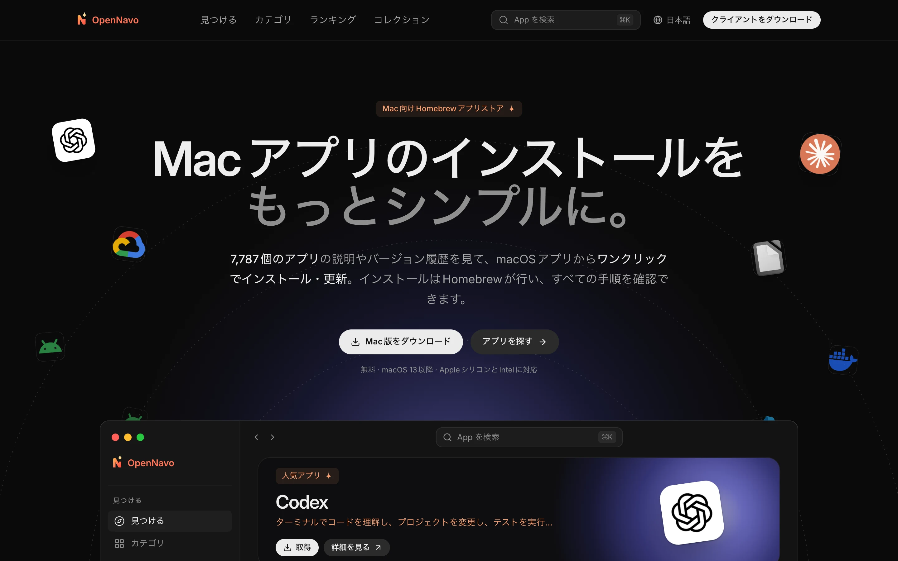
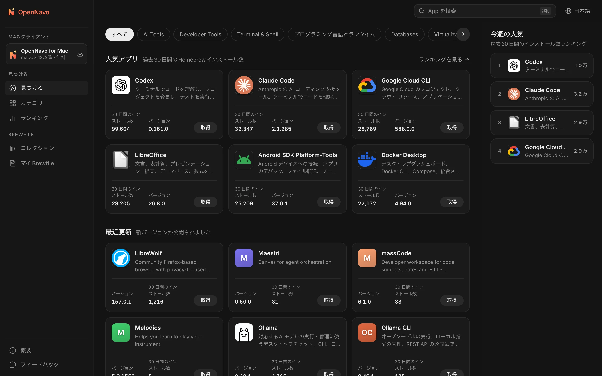
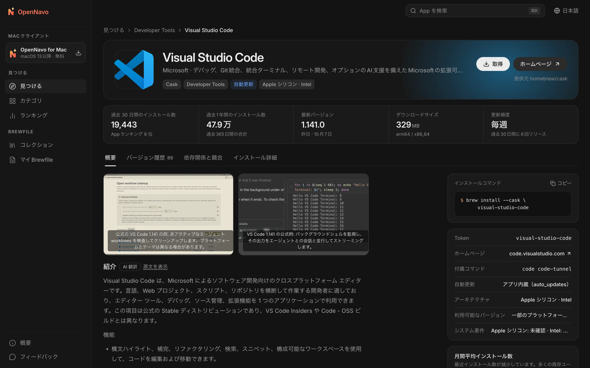
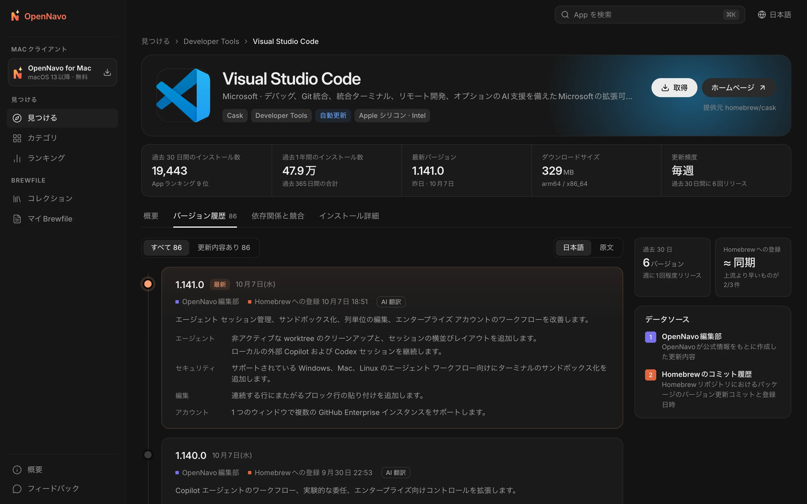

<div align="center">


# OpenNavo

[English](../../README.md) · [简体中文](README.zh-CN.md) · **日本語** · [Español](README.es-ES.md) · [Português (Brasil)](README.pt-BR.md) · [Русский](README.ru-RU.md)

**Mac のための Homebrew アプリストア**

7,700 以上の Homebrew Cask の紹介とバージョン履歴を閲覧し、<br>
macOS クライアントでワンクリックでインストール・更新。すべての処理を Homebrew が担い、その進み具合を確認できます。

[](../../LICENSE)


[公式サイト](https://opennavo.com/ja) · [App を探す](https://opennavo.com/ja/discover) · [クライアントをダウンロード](https://opennavo.com/ja/download) · [開発への参加](#開発への参加)



</div>

## はじめに

Homebrew は Mac にソフトウェアをインストールする信頼性の高い方法ですが、コマンドラインは誰にでも使いやすいわけではなく、`brew outdated` では更新内容までは分かりません。OpenNavo は Homebrew Cask にアプリストアのインターフェースを提供します。

- **Web 版**：App の閲覧・検索・比較、各バージョンの更新内容の確認、インストールコマンドのコピーができます。
- **macOS クライアント**：Web 版のすべての機能に加え、自分の Mac の Homebrew でインストール・更新・アンインストールを実行し、操作を記録します。
- **6 言語**：English、简体中文、日本語、Español、Português (Brasil)、Русский。インターフェースはすべてローカライズされ、App の紹介と更新内容は自動翻訳されます。いつでも原文に切り替えられます。
- **アカウント不要**：登録もログインも必要ありません。開くだけで使えます。

[opennavo.com](https://opennavo.com/ja) は、このリポジトリのコードで動いています。

## 機能

### Web 版

- **見つける**：カテゴリ、実際のインストール数に基づくランキング、編集部のおすすめ、コレクション。
- **検索**：英語名・中国語名・ピンイン・別名に対応しています。例えば `weixin` で WeChat、`vscode` で Visual Studio Code が見つかります。<kbd>⌘</kbd> <kbd>K</kbd> でいつでも開けます。
- **App の詳細**：紹介、スクリーンショット、インストール数と更新頻度、依存関係と競合、インストール先、アンインストール時の処理。
- **バージョン履歴**：各バージョンの更新内容をタイムラインで表示し、Homebrew への登録日時も確認できます。翻訳と原文を切り替えられます。
- **Brewfile**：閲覧中に App をリストに追加し、ワンクリックで Brewfile を生成できます。コレクションも直接エクスポートできます。
- **クライアントで開く**：`opennavo://` ディープリンクでインストールを macOS クライアントに引き継ぎます。

### macOS クライアント

- **ワンクリックでインストール・更新・アンインストール**：タスクを順番に実行し、進捗と実際の brew コマンドを表示します。失敗時はログを確認して再試行できます。
- **更新管理**：定期的な更新確認と一括更新に対応し、自動更新する App（`auto_updates`）や固定された App（pinned）も識別します。起動中の App は同意を得てから更新します。
- **ローカルの操作履歴**：インストール・更新・アンインストールをすべて記録し、エクスポートできます。
- **簡単な初期設定**：Homebrew の環境を検出し、必要ならインストールを案内します。中国国内のミラー（清華 TUNA、中国科学技術大学、Alibaba Cloud）にワンクリックで切り替えられます。
- **その他**：メニューバー常駐、Brewfile のインポートとエクスポート、オフラインのカタログ、クライアント自身の更新。

### 管理画面とコンテンツ管理

- カテゴリ、6 言語のテキスト、アイコンとアクセントカラー、スクリーンショット、おすすめ、コレクション、用語集、クライアントのお知らせを管理できます。
- 更新内容と翻訳、同期タスク、検索分析、フィードバック、クライアントのリリース、ミラー、リモート設定を管理できます。管理者・ロール・権限・監査ログに対応し、変更は復元できます。削除した項目はまずごみ箱に移動します。
- [MCP](https://modelcontextprotocol.io) サービスを内蔵しています。AI Agent は付与された権限の範囲内で App のコンテンツを管理でき、すべての書き込み操作に dry run が用意されています。

## スクリーンショット

<table>
  <tr>
    <td width="50%"></td>
    <td width="50%"></td>
  </tr>
  <tr>
    <td align="center">見つける：カテゴリ、人気の App、最近の更新</td>
    <td align="center">詳細：紹介、主要データ、インストールコマンド</td>
  </tr>
  <tr>
    <td colspan="2"></td>
  </tr>
  <tr>
    <td colspan="2" align="center">バージョン履歴：各バージョンの更新内容と Homebrew への登録日時</td>
  </tr>
</table>

## クライアントと Homebrew の連携

クライアントは自分のコンピュータでコマンドを実行するため、安全性の境界を最優先に設計しています。

- **サーバーは brew を実行しません**。インストール・更新・アンインストールは、自分の Mac 上のクライアントから実行します。
- **シェルを経由しません**：brew は引数配列で呼び出し、パッケージ名を許可リストで検証してコマンドインジェクションを防ぎます。
- **Cask のみ**：特定の App を対象にするコマンドには必ず `--cask` を付けます。Formula への書き込み操作は拒否します。
- **実行を決めるのはユーザーです**：Web のディープリンクから要求された書き込み操作は、クライアントで確認してから実行します。
- **インストーラをホスティングしません**：ダウンロード元は常に上流または Homebrew の配布元です。OpenNavo はインストーラ自体を扱いません。

## アーキテクチャ

```text
opennavo/
├── apps/
│   ├── web/                Web 版（Nuxt 4 SSR）
│   ├── desktop/            macOS クライアント（Tauri 2 · Vue 3 · Rust）
│   ├── admin/              管理画面（soybean-admin v2.2.0 ベース）
│   ├── server/             Go バックエンド：公開 API・管理 API・Agent API・ワーカー
│   └── mcp/                MCP サービス（Python · FastMCP）、バックエンドの Agent API のみを呼び出す
├── packages/
│   ├── ui/                 Web 版とクライアントの共通表示コンポーネント
│   ├── tokens/             色・角丸・文字サイズの単一の定義元
│   ├── shared/             言語一覧・エラーコード・バージョン比較などの共通処理
│   └── api/                OpenAPI 契約から生成する TypeScript 型
├── tooling/
│   ├── scripts/
│   ├── config/
│   └── i18n/
├── ops/                Docker Compose、Caddy、Prometheus / Grafana、バックアップスクリプト
├── docs/
│   ├── i18n/
│   ├── security/
│   ├── legal/
│   └── design/
└── .github/
```

バックエンドは Homebrew の公開 API からカタログとインストール数を同期し、Homebrew のコミット履歴から各バージョンの登録日時を取得します。ダウンロードサイズの検出と、クライアント用のオフラインカタログのスナップショット生成も行います。API は契約を先に定義します。`apps/server/api/*.openapi.yaml` を変更し、`make gen` で Go と TypeScript のコードを生成します。

| 部分 | 技術 |
|---|---|
| Web 版 | Nuxt 4 · Vue 3 · UnoCSS（SSR） |
| macOS クライアント | Tauri 2 · Vue 3 · Rust · SQLite（FTS5） |
| 管理画面 | soybean-admin v2.2.0 · Vue 3 · Naive UI |
| バックエンド | Go · Gin · GORM · PostgreSQL 18 · Redis 8 · asynq · S3 互換ストレージ（MinIO） |
| MCP | Python 3.13 · FastMCP · uv |
| 契約とコード生成 | OpenAPI 3.0.3 · oapi-codegen · openapi-typescript · tauri-specta |

## クイックスタート

### 必要な環境

- Node.js 24、pnpm 10
- Go 1.27、Rust 1.96
- Python 3.13 と [uv](https://docs.astral.sh/uv/)（MCP）
- Docker（ローカルの PostgreSQL、Redis、MinIO）
- macOS 13 以降（クライアントのみ）

### ローカルで実行

```sh
# ツールチェーンを確認し、依存関係をインストール
make setup

# ローカルのインフラを起動し、マイグレーションとシードを実行
make infra migrate seed

# Homebrew の公開 API からカタログを同期（ネットワーク接続が必要）
node tooling/scripts/tasks/server.mjs catalog-sync

# それぞれ別のターミナルで起動
make dev-api           # 公開 API と管理 API    http://localhost:8080
make dev-worker        # ワーカー：同期・翻訳・スナップショット
make dev-web           # Web 版                 http://localhost:3000
make dev-admin         # 管理画面               http://localhost:9527
make dev-desktop       # macOS クライアント（Tauri）
```

ローカルの管理者アカウントは `apps/server/.env.example` の `ADMIN_BOOTSTRAP_USERNAME` / `ADMIN_BOOTSTRAP_PASSWORD` で設定され、開発専用です。すべてのコマンドは `make help` で確認できます。

フロントエンドのみを変更する場合は、バックエンドを起動せずに開発できます。`make mock` が OpenAPI 契約に従って Prism のモック API を起動します（公開 4010、管理 4011）。続いて `MOCK=1 make dev-web` または `MOCK=1 make dev-admin` を実行します。`make dev-desktop-web` ではクライアントの画面をブラウザで実行し、システム呼び出しをモックで置き換えます。

### 設定

- `apps/server/.env.example` にバックエンドの環境変数とローカルの既定値を記載しています。API キーなどのローカルの秘密情報は、Git の対象外である `apps/server/.env.local` に保存してください。バックエンドが起動時に自動で読み込みます。
- コンテンツ翻訳は初期状態では無効です。管理画面の「システム → 翻訳 AI 設定」で、OpenAI 互換 API の URL・キー・モデルを設定すると有効になります。管理画面で未設定の場合は、環境変数 `LLM_BASE_URL`（既定値 `https://api.openai.com/v1`）、`LLM_API_KEY`、`LLM_MODEL` を使用します。
- `APP_ENV` が `staging` または `prod` の場合、バックエンドは `.env.example` のサンプルの秘密情報を拒否し、公開の既定値でのデプロイを防ぎます。

### テスト

```sh
make lint test
```

OpenAPI の検証、Go / TypeScript / Rust / Python の静的検査と単体テスト、6 言語の文言の完全性チェックを実行します。ブラウザの E2E テストは `make e2e` で実行できます。

> [!IMPORTANT]
> 開発・テスト中に自分のコンピュータで実際の `brew install`、`upgrade`、`uninstall`、`cleanup`、`update` を実行しないでください。クライアントの書き込み操作はモック brew でテストします。`OPENNAVO_BREW_PATH` に `apps/desktop/src-tauri/tests/fake-brew/brew` を指定してください。

## デプロイ

本番環境の構成は `ops/docker-compose.prod.yml` です。API と Web 版をそれぞれ 2 レプリカで実行し、ワーカー・Redis・Caddy を含みます。PostgreSQL（`local-db`）、Prometheus / Grafana / asynqmon（`monitoring`）、毎日のバックアップ（`backup`）は必要な profile で有効にします。

1. `ops/.env.example` に従って、ドメイン・イメージ・各種 32 バイト以上の秘密情報を設定します。環境ファイルはリポジトリの外に置いてください。
2. イメージをビルドまたは取得します。バックエンドは `docker build --target server server`、Web 版は `docker build -f apps/web/Dockerfile .`、管理画面の静的ファイルは `pnpm --filter @opennavo/admin build` です。`server-v*`、`web-v*`、`mcp-v*` タグを push すると、GitHub Actions が対応するイメージをビルド・公開します。
3. マイグレーション（`ops/migrate.sh`）、オブジェクトストレージの初期化（`storage-init`）、シード（`seed`）の順に実行し、すべてのサービスを起動します。初回ログイン後、初期管理者のパスワードをすぐに変更してください。
4. 以降の更新では `ops/rollout.py` で API レプリカを順次置き換えられます。まずそのまま実行して計画を確認し、確認後に `--apply` を付けて適用します。

## 開発への参加

Issue と Pull Request を歓迎します。作業前に以下をご確認ください。

- **契約を先に定義**：API の変更はまず `apps/server/api/*.openapi.yaml` に反映し、`make gen` の後で実装を変更します。生成ファイルを手で編集しないでください。
- **デザイントークン**：色・角丸などは `packages/tokens/tokens.json` を使い、コンポーネントに色を直接記述しないでください。
- **データベース**：新しいマイグレーションファイルを追加し、既存のファイルは変更しないでください。
- **文言**：ユーザー向けのテキストは言語ファイルに入れ、6 言語すべてを用意してください。`make lint` が完全性を検証します。
- **コミットメッセージ**：[Conventional Commits](https://www.conventionalcommits.org/en/) に従います。例：`feat(desktop): …`、`fix(server): …`。
- コミット前に `make lint test` が通ることを確認してください。

## セキュリティ

脆弱性を発見した場合は公開の Issue を作成せず、リポジトリの **Security → Report a vulnerability** から非公開でご報告ください。できるだけ早く対応します。

## ライセンス

本プロジェクトは [Apache License 2.0](../../LICENSE) で公開されています。サードパーティの表記は [NOTICE](../../NOTICE) をご覧ください。

「OpenNavo」の名称とロゴはこのライセンスの対象ではありません。変更版を配布する場合は別の名称とアイコンを使い、クライアントの Bundle ID、更新用公開鍵、更新 URL を置き換えてください。Homebrew は Homebrew プロジェクトの商標であり、OpenNavo は Homebrew の公式プロジェクトとは関係ありません。各 App の名称とアイコンは、それぞれの権利者に帰属します。

[デプロイガイド](../../ops/GUIDE.md) · [貢献ガイド](../../.github/CONTRIBUTING.md) · [セキュリティポリシー](../../.github/SECURITY.md) · [サードパーティライセンス](../legal/THIRD_PARTY.md)
