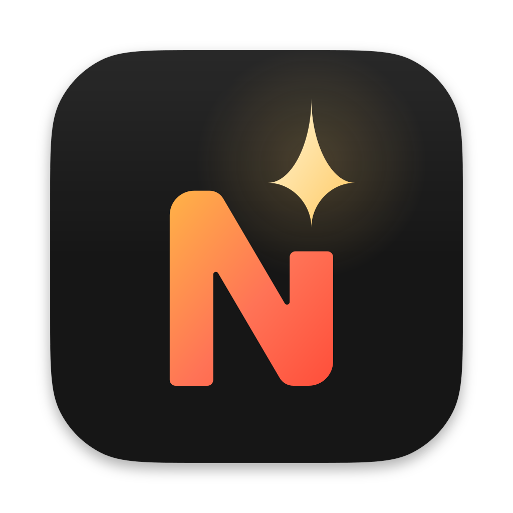
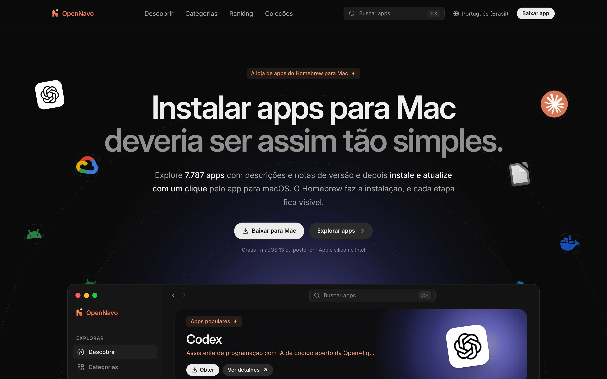
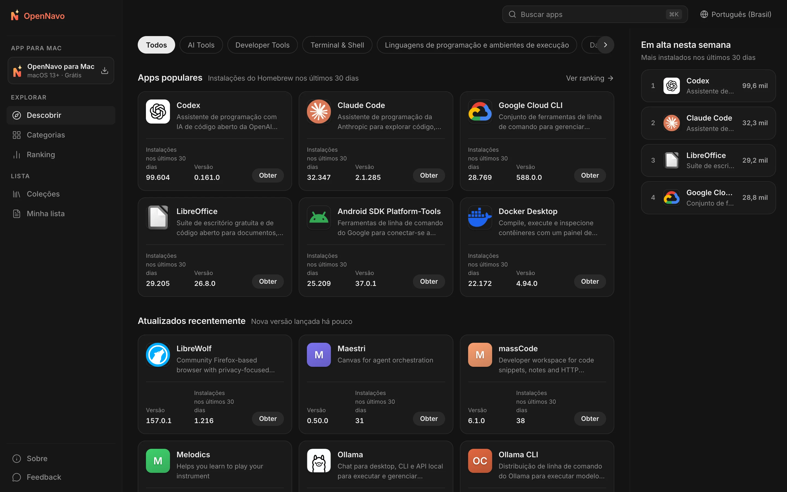
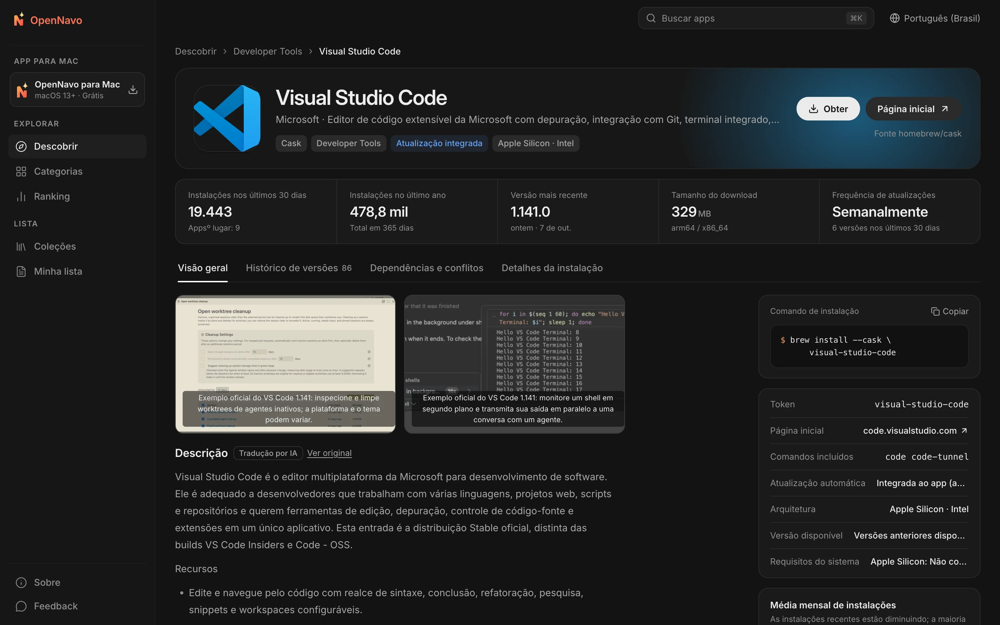
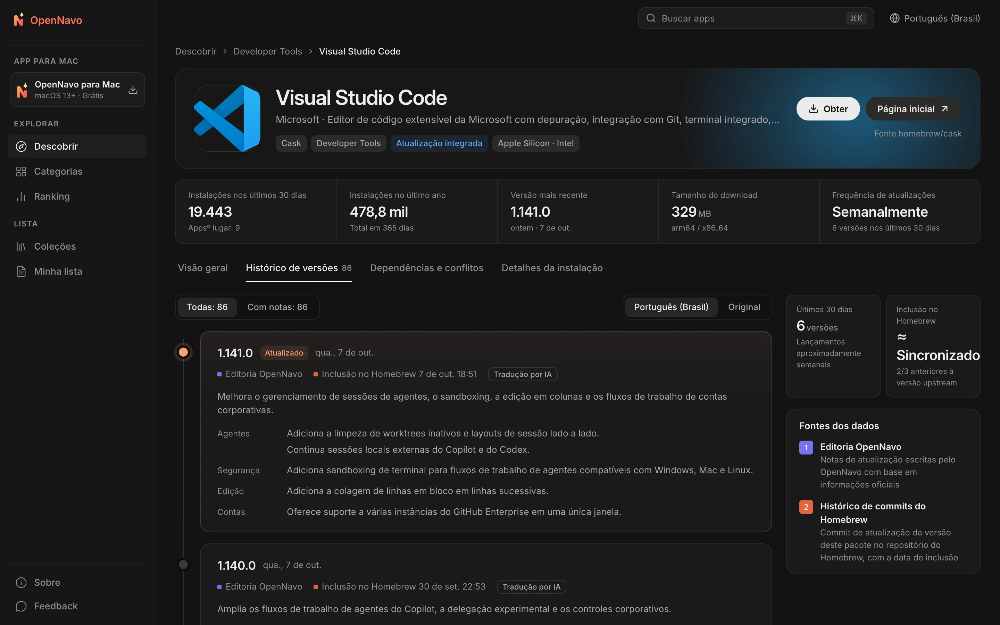

<div align="center">



# OpenNavo

[English](../../README.md) · [简体中文](README.zh-CN.md) · [日本語](README.ja-JP.md) · [Español](README.es-ES.md) · **Português (Brasil)** · [Русский](README.ru-RU.md)

**A loja de apps do Homebrew para Mac**

Explore descrições e notas de versão de mais de 7.700 Homebrew Casks,<br>
e instale e atualize com um clique pelo app para macOS. O Homebrew cuida de cada etapa, e você acompanha todo o processo.

[](../../LICENSE)


[Site](https://opennavo.com/pt) · [Explorar apps](https://opennavo.com/pt/discover) · [Baixar](https://opennavo.com/pt/download) · [Como contribuir](#como-contribuir)



</div>

## Introdução

O Homebrew é uma forma confiável de instalar software no Mac, mas a linha de comando não é confortável para todo mundo, e `brew outdated` não explica o que mudou. O OpenNavo oferece uma interface de loja de apps para o Homebrew Cask:

- **Web**: Navegue, pesquise e compare apps, consulte as notas de cada versão e copie comandos de instalação.
- **App para macOS**: Todos os recursos da web, além de instalação, atualização e desinstalação pelo Homebrew do seu Mac, com um registro de cada operação.
- **Seis idiomas**: English, 简体中文, 日本語, Español, Português (Brasil) e Русский. Toda a interface é localizada; descrições e notas de versão são traduzidas automaticamente, e você pode consultar o texto original a qualquer momento.
- **Sem conta**: Não é preciso se cadastrar nem fazer login. Basta abrir e começar a usar.

[opennavo.com](https://opennavo.com/pt) usa o código deste repositório.

## Recursos

### Web

- **Descobrir**: Categorias, rankings com base em instalações reais, seleções editoriais e coleções.
- **Pesquisa**: Nomes em inglês e chinês, pinyin e apelidos. Por exemplo, `weixin` encontra o WeChat, e `vscode` encontra o Visual Studio Code. Pressione <kbd>⌘</kbd> <kbd>K</kbd> a qualquer momento.
- **Detalhes dos apps**: Descrições, capturas de tela, instalações e frequência de atualização, dependências e conflitos, caminhos de instalação e comportamento da desinstalação.
- **Notas de versão**: Uma linha do tempo com as mudanças de cada versão, a data de inclusão no Homebrew e a opção de alternar entre a tradução e o original.
- **Brewfile**: Adicione apps à sua lista enquanto navega e gere um Brewfile com um clique. Coleções também podem ser exportadas diretamente.
- **Abrir no app**: Transfira a instalação para o app de macOS por links diretos `opennavo://`.

### App para macOS

- **Instale, atualize e desinstale com um clique**: As tarefas são executadas em fila, com progresso em tempo real e os comandos brew efetivamente usados. Em caso de falha, consulte os logs e tente novamente.
- **Gerenciamento de atualizações**: Verificações periódicas e atualização de todos os apps com um clique. Reconhece apps que se atualizam sozinhos (`auto_updates`) e apps fixados (pinned). Pede sua autorização antes de atualizar um app em execução.
- **Histórico local**: Registra cada instalação, atualização e desinstalação, com opção de exportação.
- **Configuração fácil**: Detecta o ambiente do Homebrew e orienta a instalação. Troque com um clique entre mirrors na China: Tsinghua TUNA, USTC e Alibaba Cloud.
- **Mais recursos**: App na barra de menus, importação e exportação de Brewfile, catálogo offline e atualizações do próprio OpenNavo.

### Administração e gerenciamento de conteúdo

- Gerencie categorias, textos em seis idiomas, ícones e cores de destaque, capturas de tela, seleções editoriais, coleções, glossários e avisos do cliente.
- Gerencie notas de versão e traduções, tarefas de sincronização, análises de pesquisa, feedback, versões do cliente, mirrors e configurações remotas. Inclui administradores, funções, permissões e logs de auditoria. Alterações podem ser restauradas, e itens excluídos vão primeiro para a lixeira.
- Serviço [MCP](https://modelcontextprotocol.io) integrado: agentes de IA podem manter o conteúdo dos apps dentro das permissões concedidas. Todas as operações de escrita permitem simulação (dry run).

## Capturas de tela

<table>
  <tr>
    <td width="50%"></td>
    <td width="50%"></td>
  </tr>
  <tr>
    <td align="center">Descobrir: categorias, apps populares e atualizações recentes</td>
    <td align="center">Detalhes: descrição, dados principais e comandos de instalação</td>
  </tr>
  <tr>
    <td colspan="2"></td>
  </tr>
  <tr>
    <td colspan="2" align="center">Notas de versão: mudanças de cada versão e data de inclusão no Homebrew</td>
  </tr>
</table>

## Como o app usa o Homebrew

O app executa comandos no seu computador, por isso limites claros de segurança são a prioridade do projeto:

- **O servidor nunca executa brew**. Instalações, atualizações e desinstalações são iniciadas pelo app no seu Mac.
- **Sem passar por um shell**: brew é chamado com um array de argumentos. Os nomes dos pacotes passam por uma lista de permitidos para evitar injeção de comandos.
- **Somente Cask**: Comandos direcionados a um app específico incluem explicitamente `--cask`. Operações de escrita em Formula são rejeitadas.
- **Você decide**: Qualquer operação de escrita solicitada por um link direto da web precisa da sua confirmação no app antes de ser executada.
- **Sem hospedar instaladores**: Os downloads sempre vêm do fornecedor original ou do Homebrew. O OpenNavo não gerencia os instaladores em si.

## Arquitetura

```text
opennavo/
├── apps/
│   ├── web/                App web (Nuxt 4 SSR)
│   ├── desktop/            App para macOS (Tauri 2 · Vue 3 · Rust)
│   ├── admin/              Painel administrativo (soybean-admin v2.2.0)
│   ├── server/             Backend Go: APIs pública, administrativa e de agentes; worker
│   └── mcp/                Serviço MCP (Python · FastMCP), chama apenas a API de agentes do backend
├── packages/
│   ├── ui/                 Componentes de apresentação compartilhados entre web e desktop
│   ├── tokens/             Fonte única de cores, raios e tamanhos de texto
│   ├── shared/             Idiomas, códigos de erro, comparação de versões e lógica comum
│   └── api/                Tipos TypeScript gerados a partir dos contratos OpenAPI
├── tooling/
│   ├── scripts/
│   ├── config/
│   └── i18n/
├── ops/                Docker Compose, Caddy, Prometheus / Grafana e scripts de backup
├── docs/
│   ├── i18n/
│   ├── security/
│   ├── legal/
│   └── design/
└── .github/
```

O backend sincroniza o catálogo e os números de instalações pelas APIs públicas do Homebrew, lê seus commits para identificar quando cada versão foi incluída, verifica os tamanhos de download e gera snapshots do catálogo para uso offline. As APIs seguem um fluxo que começa pelos contratos: altere `apps/server/api/*.openapi.yaml` e execute `make gen` para gerar código Go e TypeScript.

| Parte | Tecnologia |
|---|---|
| Web | Nuxt 4 · Vue 3 · UnoCSS (SSR) |
| App para macOS | Tauri 2 · Vue 3 · Rust · SQLite (FTS5) |
| Administração | soybean-admin v2.2.0 · Vue 3 · Naive UI |
| Backend | Go · Gin · GORM · PostgreSQL 18 · Redis 8 · asynq · armazenamento compatível com S3 (MinIO) |
| MCP | Python 3.13 · FastMCP · uv |
| Contratos e geração | OpenAPI 3.0.3 · oapi-codegen · openapi-typescript · tauri-specta |

## Início rápido

### Requisitos

- Node.js 24 e pnpm 10
- Go 1.27 e Rust 1.96
- Python 3.13 e [uv](https://docs.astral.sh/uv/) (MCP)
- Docker (PostgreSQL, Redis e MinIO locais)
- macOS 13 ou posterior (somente para o app de desktop)

### Executar localmente

```sh
# Verificar as ferramentas e instalar as dependências
make setup

# Iniciar a infraestrutura local, executar migrações e carregar dados iniciais
make infra migrate seed

# Sincronizar o catálogo pela API pública do Homebrew (requer conexão)
node tooling/scripts/tasks/server.mjs catalog-sync

# Executar cada comando em um terminal separado
make dev-api           # APIs pública e administrativa    http://localhost:8080
make dev-worker        # Worker: sincronização, tradução e snapshots
make dev-web           # App web                          http://localhost:3000
make dev-admin         # Painel administrativo            http://localhost:9527
make dev-desktop       # App para macOS (Tauri)
```

As credenciais do administrador local são definidas por `ADMIN_BOOTSTRAP_USERNAME` / `ADMIN_BOOTSTRAP_PASSWORD` em `apps/server/.env.example` e servem apenas para desenvolvimento. Execute `make help` para ver todos os comandos.

Para alterações apenas no frontend, não é necessário iniciar o backend: `make mock` oferece APIs simuladas com Prism a partir dos contratos OpenAPI (pública na porta 4010, administrativa na 4011). Depois, execute `MOCK=1 make dev-web` ou `MOCK=1 make dev-admin`. `make dev-desktop-web` executa a interface de desktop no navegador e substitui chamadas ao sistema por mocks.

### Configuração

- `apps/server/.env.example` lista todas as variáveis de ambiente do backend e os valores locais padrão. Guarde segredos locais, como chaves de API, em `apps/server/.env.local`, que é ignorado pelo Git; o backend lê esse arquivo automaticamente ao iniciar.
- A tradução de conteúdo vem desativada por padrão. Ative em **Sistema → Configurações de IA de tradução** no painel administrativo, informando a URL, a chave e o modelo de uma API compatível com OpenAI. Quando o painel não está configurado, são usadas as variáveis `LLM_BASE_URL` (padrão: `https://api.openai.com/v1`), `LLM_API_KEY` e `LLM_MODEL`.
- Quando `APP_ENV` é `staging` ou `prod`, o backend rejeita os segredos de exemplo de `.env.example` para impedir um deploy com valores públicos padrão.

### Testes

```sh
make lint test
```

Inclui validação de OpenAPI, análise estática e testes unitários de Go / TypeScript / Rust / Python, além da verificação de integridade dos textos nos seis idiomas. Os testes de ponta a ponta no navegador estão disponíveis com `make e2e`.

> [!IMPORTANT]
> Durante o desenvolvimento e os testes, não execute de verdade `brew install`, `upgrade`, `uninstall`, `cleanup` nem `update` no seu computador. Teste as operações de escrita do cliente com o brew simulado: configure `OPENNAVO_BREW_PATH` como `apps/desktop/src-tauri/tests/fake-brew/brew`.

## Deploy

O deploy em produção começa por `ops/docker-compose.prod.yml`: duas réplicas da API, duas da web, um worker, Redis e Caddy. PostgreSQL (`local-db`), Prometheus / Grafana / asynqmon (`monitoring`) e backups diários (`backup`) são ativados por perfis opcionais.

1. Prepare as variáveis conforme `ops/.env.example`: domínios, imagens e segredos de pelo menos 32 bytes cada um. Mantenha o arquivo de ambiente fora do repositório.
2. Compile ou baixe as imagens: `docker build --target server server` para o backend, `docker build -f apps/web/Dockerfile .` para a web e `pnpm --filter @opennavo/admin build` para os arquivos estáticos do painel. O envio de tags `server-v*`, `web-v*` ou `mcp-v*` aciona o GitHub Actions para compilar e publicar as imagens correspondentes.
3. Execute as migrações (`ops/migrate.sh`), a inicialização do armazenamento de objetos (`storage-init`) e os dados iniciais (`seed`), nessa ordem, e inicie todos os serviços. Troque a senha do administrador inicial imediatamente após o primeiro login.
4. Nas próximas atualizações, `ops/rollout.py` substitui as réplicas da API gradualmente. Execute primeiro sem opções para revisar o plano e adicione `--apply` para aplicá-lo depois de confirmar.

## Como contribuir

Issues e pull requests são bem-vindas. Antes de começar:

- **Contratos primeiro**: Altere `apps/server/api/*.openapi.yaml` antes da implementação e execute `make gen`. Não edite arquivos gerados manualmente.
- **Tokens de design**: Use `packages/tokens/tokens.json` para cores, raios e outros valores. Não escreva cores diretamente nos componentes.
- **Banco de dados**: Adicione novas migrações; não altere as existentes.
- **Textos**: Coloque todo texto destinado ao usuário nos arquivos de idiomas, com versões nos seis idiomas. `make lint` verifica a integridade.
- **Mensagens de commit**: Siga [Conventional Commits](https://www.conventionalcommits.org/en/), por exemplo `feat(desktop): …` ou `fix(server): …`.
- Verifique se `make lint test` passa antes de fazer um commit.

## Segurança

Se encontrar uma vulnerabilidade, relate em particular pela opção **Security → Report a vulnerability** do repositório, em vez de abrir uma issue pública. Responderemos assim que possível.

## Licença

Este projeto é de código aberto sob a [Apache License 2.0](../../LICENSE). Os avisos de componentes de terceiros estão em [NOTICE](../../NOTICE).

O nome e o logotipo OpenNavo não são cobertos por essa licença. Ao distribuir uma versão modificada, use outro nome e ícone e substitua o Bundle ID, a chave pública de atualização e a URL de atualização do cliente. Homebrew é uma marca do projeto Homebrew; o OpenNavo não é afiliado ao Homebrew. Os nomes e ícones dos apps pertencem aos respectivos titulares.

[Guia de implantação](../../ops/GUIDE.md) · [Contribuir](../../.github/CONTRIBUTING.md) · [Política de segurança](../../.github/SECURITY.md) · [Licenças de terceiros](../legal/THIRD_PARTY.md)
