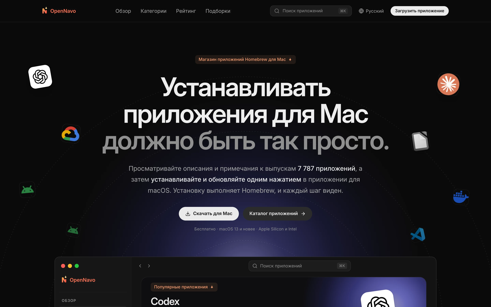
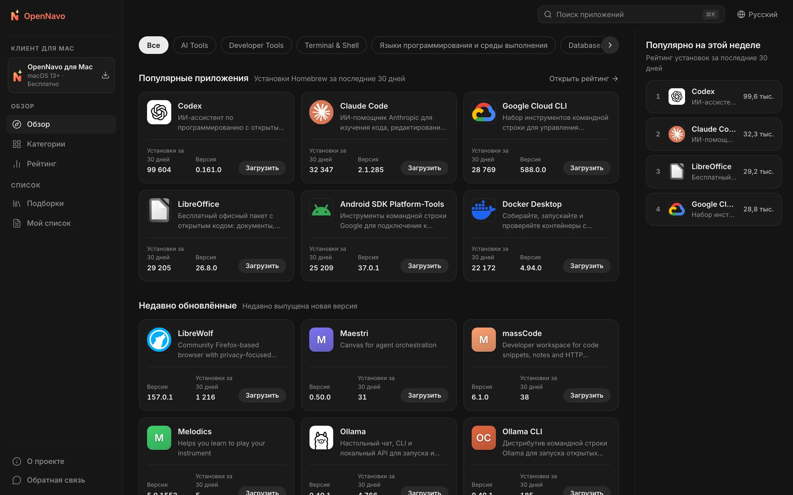
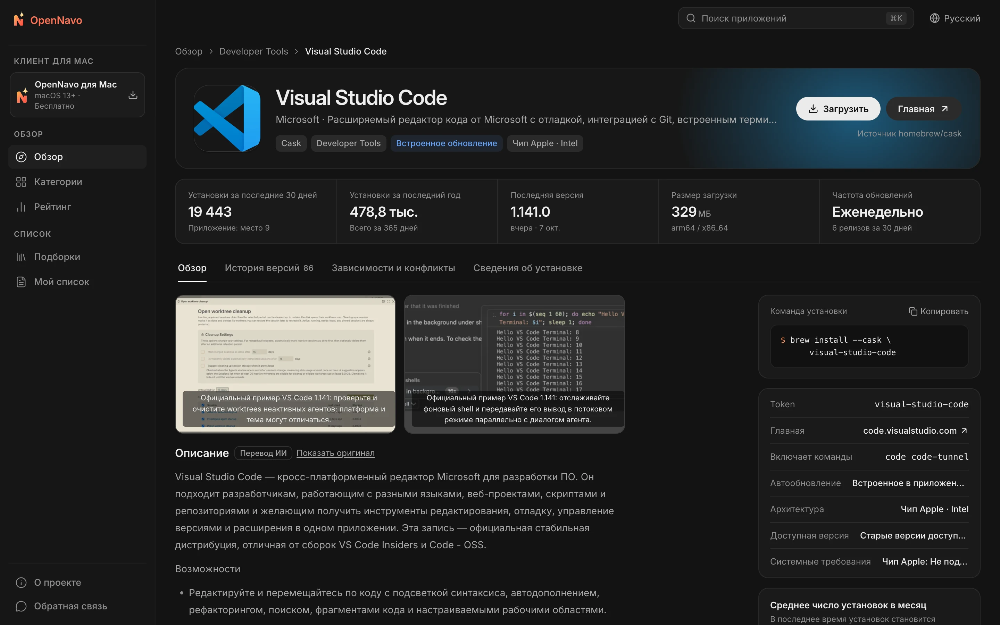
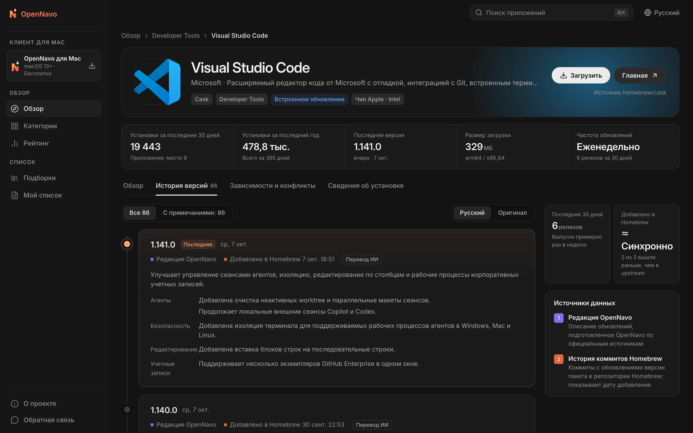

<div align="center">


# OpenNavo

[English](../../README.md) · [简体中文](README.zh-CN.md) · [日本語](README.ja-JP.md) · [Español](README.es-ES.md) · [Português (Brasil)](README.pt-BR.md) · **Русский**

**Магазин приложений Homebrew для Mac**

Читайте описания и историю версий более 7 700 Homebrew Cask,<br>
устанавливайте и обновляйте приложения одним нажатием в клиенте для macOS. Каждый шаг выполняет Homebrew, а вы видите весь процесс.

[](../../LICENSE)


[Сайт](https://opennavo.com/ru) · [Каталог приложений](https://opennavo.com/ru/discover) · [Скачать клиент](https://opennavo.com/ru/download) · [Участие в разработке](#участие-в-разработке)



</div>

## О проекте

Homebrew — надёжный способ устанавливать программы на Mac, но командная строка удобна не всем, а `brew outdated` не рассказывает, что изменилось в новой версии. OpenNavo даёт Homebrew Cask интерфейс магазина приложений:

- **Веб-версия**: Просматривайте, ищите и сравнивайте приложения, читайте примечания к каждой версии и копируйте команды установки.
- **Клиент для macOS**: Все возможности веб-версии, а также установка, обновление и удаление через Homebrew на вашем Mac с записью каждой операции.
- **Шесть языков**: English, 简体中文, 日本語, Español, Português (Brasil) и Русский. Весь интерфейс локализован; описания приложений и примечания к версиям переводятся автоматически. В любой момент можно открыть оригинал.
- **Без учётной записи**: Регистрация и вход не нужны. Просто откройте и начните пользоваться.

[opennavo.com](https://opennavo.com/ru) работает на коде из этого репозитория.

## Возможности

### Веб-версия

- **Обзор**: Категории, рейтинги по реальному числу установок, выбор редакции и коллекции.
- **Поиск**: Английские и китайские названия, пиньинь и альтернативные имена. Например, `weixin` находит WeChat, а `vscode` — Visual Studio Code. Нажмите <kbd>⌘</kbd> <kbd>K</kbd> в любой момент.
- **Страница приложения**: Описание, скриншоты, число установок и частота обновлений, зависимости и конфликты, пути установки и действия при удалении.
- **История версий**: Хронология изменений каждой версии с датой её добавления в Homebrew. Можно переключаться между переводом и оригиналом.
- **Brewfile**: Добавляйте приложения в список во время просмотра и создавайте Brewfile одним нажатием. Коллекции также можно экспортировать напрямую.
- **Открыть в клиенте**: Передайте установку клиенту для macOS через ссылки `opennavo://`.

### Клиент для macOS

- **Установка, обновление и удаление одним нажатием**: Задачи выполняются по очереди с отображением прогресса и реальных команд brew. При ошибке можно посмотреть журнал и повторить задачу.
- **Управление обновлениями**: Проверки по расписанию и обновление всех приложений одним нажатием. Учитываются приложения с собственным обновлением (`auto_updates`) и закреплённые приложения (pinned). Перед обновлением запущенного приложения клиент запросит ваше согласие.
- **Локальная история**: Каждая установка, обновление и удаление записываются; историю можно экспортировать.
- **Простая настройка**: Клиент определяет окружение Homebrew и помогает с его установкой. Одним нажатием можно переключиться на зеркала в Китае: Tsinghua TUNA, USTC или Alibaba Cloud.
- **Дополнительно**: Работа в строке меню, импорт и экспорт Brewfile, автономный каталог и обновления самого клиента.

### Панель управления и работа с контентом

- Управление категориями, текстами на шести языках, значками и акцентными цветами, скриншотами, выбором редакции, коллекциями, глоссарием и объявлениями для клиента.
- Управление примечаниями к версиям и переводами, задачами синхронизации, аналитикой поиска, обратной связью, выпусками клиента, зеркалами и удалёнными настройками. Предусмотрены администраторы, роли, права доступа и журнал аудита. Изменения можно восстановить, а удалённые объекты сначала попадают в корзину.
- Встроенный сервис [MCP](https://modelcontextprotocol.io): ИИ-агенты могут поддерживать контент приложений в пределах выданных прав. Все операции записи поддерживают пробный запуск (dry run).

## Скриншоты

<table>
  <tr>
    <td width="50%"></td>
    <td width="50%"></td>
  </tr>
  <tr>
    <td align="center">Обзор: категории, популярные приложения и недавние обновления</td>
    <td align="center">Приложение: описание, основные данные и команды установки</td>
  </tr>
  <tr>
    <td colspan="2"></td>
  </tr>
  <tr>
    <td colspan="2" align="center">История версий: изменения каждой версии и дата её добавления в Homebrew</td>
  </tr>
</table>

## Как клиент использует Homebrew

Клиент выполняет команды на вашем компьютере, поэтому чёткие границы безопасности — главный принцип его устройства:

- **Сервер никогда не запускает brew**. Установку, обновление и удаление инициирует клиент на вашем Mac.
- **Без командной оболочки**: brew вызывается с массивом аргументов. Имена пакетов проверяются по списку допустимых значений, чтобы предотвратить внедрение команд.
- **Только Cask**: Команды для конкретного приложения явно содержат `--cask`. Операции записи для Formula отклоняются.
- **Решение за вами**: Любая операция записи, запрошенная через ссылку на сайте, выполняется только после подтверждения в клиенте.
- **Без размещения установщиков**: Загрузка всегда идёт от разработчика или из источников Homebrew. OpenNavo не обрабатывает сами установщики.

## Архитектура

```text
opennavo/
├── apps/
│   ├── web/                Веб-версия (Nuxt 4 SSR)
│   ├── desktop/            Клиент для macOS (Tauri 2 · Vue 3 · Rust)
│   ├── admin/              Панель управления (на основе soybean-admin v2.2.0)
│   ├── server/             Go-бэкенд: публичный API, API администрирования и агентов; worker
│   └── mcp/                Сервис MCP (Python · FastMCP), обращается только к API агентов бэкенда
├── packages/
│   ├── ui/                 Общие компоненты отображения для веб-версии и клиента
│   ├── tokens/             Единый источник цветов, радиусов скругления и размеров текста
│   ├── shared/             Языки, коды ошибок, сравнение версий и общая логика
│   └── api/                Типы TypeScript, сгенерированные из контрактов OpenAPI
├── tooling/
│   ├── scripts/
│   ├── config/
│   └── i18n/
├── ops/                Docker Compose, Caddy, Prometheus / Grafana, скрипты резервного копирования
├── docs/
│   ├── i18n/
│   ├── security/
│   ├── legal/
│   └── design/
└── .github/
```

Бэкенд синхронизирует каталог и число установок из публичных API Homebrew, читает коммиты Homebrew, чтобы определить дату добавления каждой версии, проверяет размеры загрузок и создаёт снимки каталога для автономной работы клиента. Работа с API начинается с контракта: сначала меняется `apps/server/api/*.openapi.yaml`, затем `make gen` генерирует код Go и TypeScript.

| Часть | Технологии |
|---|---|
| Веб-версия | Nuxt 4 · Vue 3 · UnoCSS (SSR) |
| Клиент для macOS | Tauri 2 · Vue 3 · Rust · SQLite (FTS5) |
| Панель управления | soybean-admin v2.2.0 · Vue 3 · Naive UI |
| Бэкенд | Go · Gin · GORM · PostgreSQL 18 · Redis 8 · asynq · S3-совместимое хранилище (MinIO) |
| MCP | Python 3.13 · FastMCP · uv |
| Контракты и генерация | OpenAPI 3.0.3 · oapi-codegen · openapi-typescript · tauri-specta |

## Быстрый старт

### Требования

- Node.js 24 и pnpm 10
- Go 1.27 и Rust 1.96
- Python 3.13 и [uv](https://docs.astral.sh/uv/) (MCP)
- Docker (локальные PostgreSQL, Redis и MinIO)
- macOS 13 или новее (только для клиента)

### Локальный запуск

```sh
# Проверить инструменты и установить зависимости
make setup

# Запустить локальную инфраструктуру, выполнить миграции и загрузить начальные данные
make infra migrate seed

# Синхронизировать каталог из публичного API Homebrew (нужен доступ к сети)
node tooling/scripts/tasks/server.mjs catalog-sync

# Запустить каждую команду в отдельном терминале
make dev-api           # Публичный API и API администрирования    http://localhost:8080
make dev-worker        # Worker: синхронизация, переводы, снимки каталога
make dev-web           # Веб-версия                               http://localhost:3000
make dev-admin         # Панель управления                        http://localhost:9527
make dev-desktop       # Клиент для macOS (Tauri)
```

Учётные данные локального администратора задаются в `apps/server/.env.example` через `ADMIN_BOOTSTRAP_USERNAME` / `ADMIN_BOOTSTRAP_PASSWORD` и предназначены только для разработки. Все команды доступны через `make help`.

Если вы меняете только фронтенд, можно обойтись без запуска бэкенда: `make mock` запускает имитацию API через Prism по контрактам OpenAPI (публичный API на порту 4010, административный — на 4011). Затем выполните `MOCK=1 make dev-web` или `MOCK=1 make dev-admin`. `make dev-desktop-web` запускает интерфейс клиента в браузере, заменяя системные вызовы имитациями.

### Настройка

- В `apps/server/.env.example` перечислены переменные окружения бэкенда и локальные значения по умолчанию. Локальные секреты, например ключи API, храните в `apps/server/.env.local`, который исключён из Git. Бэкенд автоматически читает его при запуске.
- Перевод контента по умолчанию отключён. Для включения в панели управления откройте **Система → Настройки ИИ-перевода** и укажите адрес, ключ и модель любого API, совместимого с OpenAI. Если настройки в панели не заданы, используются `LLM_BASE_URL` (по умолчанию `https://api.openai.com/v1`), `LLM_API_KEY` и `LLM_MODEL`.
- Если `APP_ENV` имеет значение `staging` или `prod`, бэкенд отклоняет секреты из примера `.env.example`, чтобы предотвратить запуск с публичными значениями по умолчанию.

### Тесты

```sh
make lint test
```

Команда включает проверку OpenAPI, статический анализ и модульные тесты Go / TypeScript / Rust / Python, а также проверку полноты текстов на всех шести языках. Сквозные браузерные тесты доступны через `make e2e`.

> [!IMPORTANT]
> При разработке и тестировании не выполняйте настоящие `brew install`, `upgrade`, `uninstall`, `cleanup` или `update` на своём компьютере. Для проверки операций записи клиента используйте имитацию brew: укажите `apps/desktop/src-tauri/tests/fake-brew/brew` в `OPENNAVO_BREW_PATH`.

## Развёртывание

Конфигурация для production находится в `ops/docker-compose.prod.yml`: по две реплики API и веб-версии, worker, Redis и Caddy. PostgreSQL (`local-db`), Prometheus / Grafana / asynqmon (`monitoring`) и ежедневные резервные копии (`backup`) включаются через дополнительные профили.

1. Подготовьте переменные по `ops/.env.example`: домены, образы и секреты длиной не менее 32 байт каждый. Храните файл окружения вне репозитория.
2. Соберите или скачайте образы: `docker build --target server server` для бэкенда, `docker build -f apps/web/Dockerfile .` для веб-версии и `pnpm --filter @opennavo/admin build` для статических файлов панели. Отправка тегов `server-v*`, `web-v*` или `mcp-v*` запускает сборку и публикацию соответствующих образов в GitHub Actions.
3. По порядку выполните миграции (`ops/migrate.sh`), инициализацию объектного хранилища (`storage-init`) и загрузку начальных данных (`seed`), затем запустите все сервисы. Сразу после первого входа смените пароль первоначального администратора.
4. Для следующих обновлений `ops/rollout.py` поочерёдно заменяет реплики API. Сначала запустите его без параметров, чтобы просмотреть план, а после подтверждения добавьте `--apply` для выполнения.

## Участие в разработке

Мы приветствуем issues и pull requests. Перед началом работы:

- **Сначала контракт**: Меняйте `apps/server/api/*.openapi.yaml` до реализации и запускайте `make gen`. Не редактируйте сгенерированные файлы вручную.
- **Токены дизайна**: Цвета, радиусы и другие значения берите из `packages/tokens/tokens.json`. Не задавайте цвета напрямую в компонентах.
- **База данных**: Добавляйте новые миграции, не изменяя существующие.
- **Тексты**: Все пользовательские тексты должны быть в языковых файлах и доступны на шести языках. `make lint` проверяет полноту.
- **Сообщения коммитов**: Следуйте [Conventional Commits](https://www.conventionalcommits.org/en/), например `feat(desktop): …` или `fix(server): …`.
- Перед коммитом убедитесь, что `make lint test` проходит.

## Безопасность

Если вы обнаружили уязвимость, сообщите о ней конфиденциально через **Security → Report a vulnerability** в репозитории, вместо создания публичной issue. Мы ответим как можно скорее.

## Лицензия

Проект распространяется с открытым исходным кодом по [Apache License 2.0](../../LICENSE). Уведомления о сторонних компонентах находятся в [NOTICE](../../NOTICE).

Название и логотип OpenNavo не подпадают под эту лицензию. При распространении изменённой версии используйте другое название и значок, а также замените Bundle ID клиента, публичный ключ обновлений и адрес обновлений. Homebrew — товарный знак проекта Homebrew; OpenNavo не связан с Homebrew официально. Названия и значки приложений принадлежат соответствующим правообладателям.

[Руководство по развёртыванию](../../ops/GUIDE.md) · [Участие в разработке](../../.github/CONTRIBUTING.md) · [Политика безопасности](../../.github/SECURITY.md) · [Сторонние лицензии](../legal/THIRD_PARTY.md)
