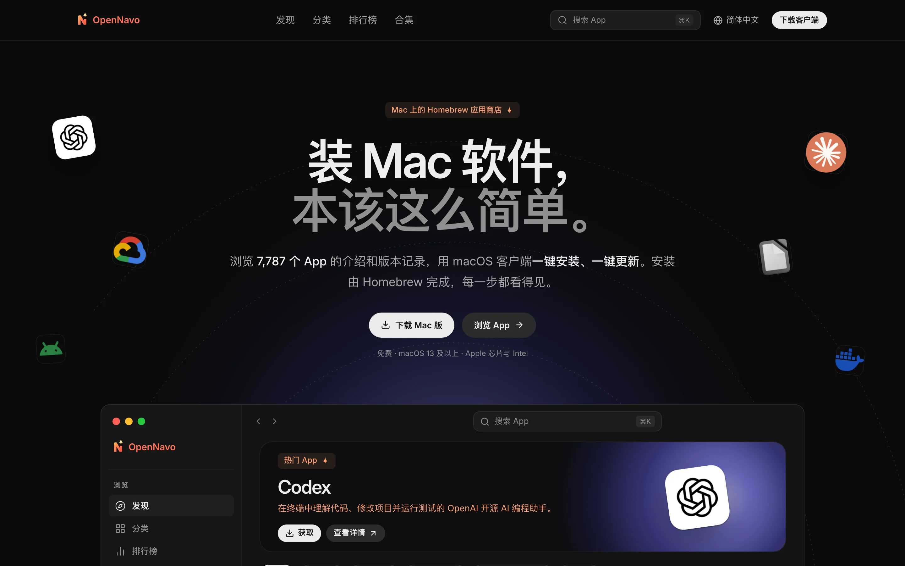
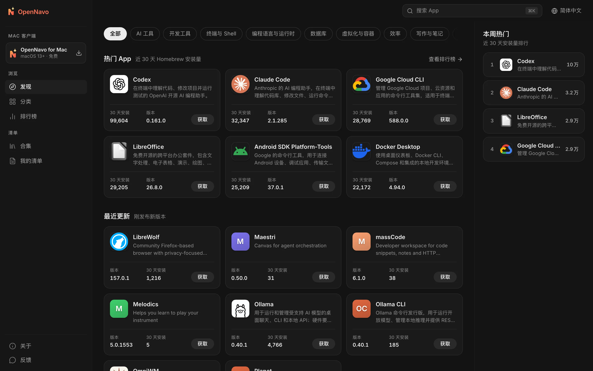
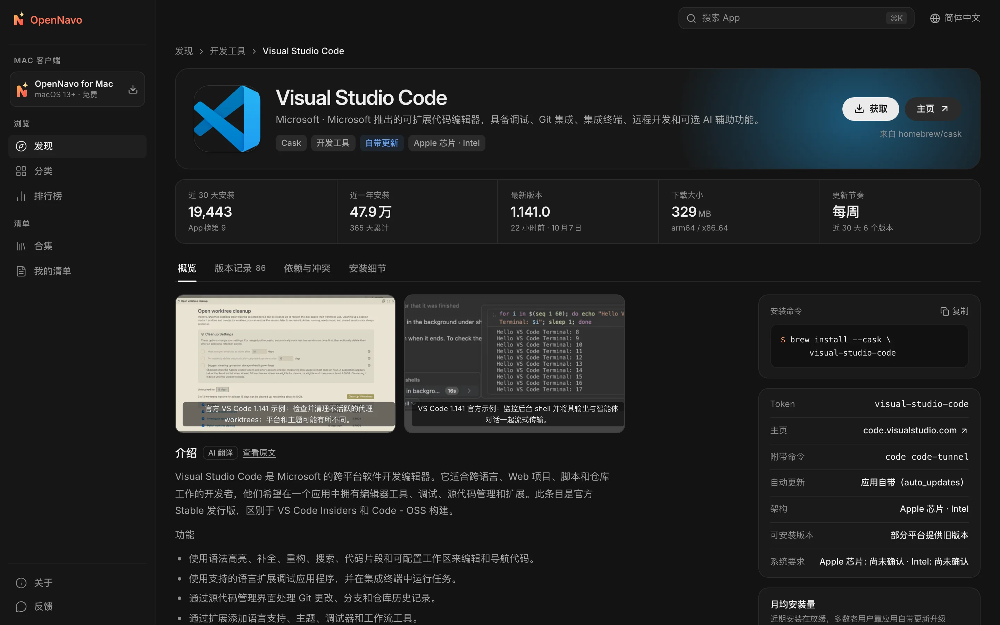
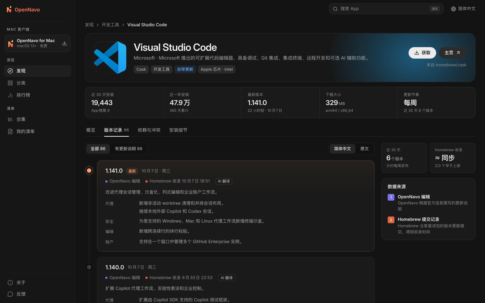

<div align="center">


# OpenNavo

[English](../../README.md) · **简体中文** · [日本語](README.ja-JP.md) · [Español](README.es-ES.md) · [Português (Brasil)](README.pt-BR.md) · [Русский](README.ru-RU.md)

**Mac 上的 Homebrew 应用商店**

浏览 7,700 多个 Homebrew Cask 的介绍与版本记录，<br>
用 macOS 客户端一键安装、一键更新——每一步都交给 Homebrew，每一步都看得见。

[](../../LICENSE)


[官网](https://opennavo.com/zh) · [浏览 App](https://opennavo.com/zh/discover) · [下载客户端](https://opennavo.com/zh/download) · [参与贡献](#参与贡献)



</div>

## 简介

Homebrew 是 Mac 上装软件最可靠的方式，但命令行不适合每个人，`brew outdated` 也不会告诉你更新了什么。OpenNavo 给 Homebrew Cask 配上一个应用商店：

- **网页端**：任何人都能浏览、搜索、比较 App，查看每个版本的更新说明，复制安装命令。
- **macOS 客户端**：在网页端的全部能力之上，调用你电脑上的 Homebrew 完成安装、更新与卸载，并记录每一次操作。
- **六种语言**：English、简体中文、日本語、Español、Português (Brasil)、Русский。界面全部本地化，App 介绍与更新说明自动翻译，随时可以切回原文。
- **无需账号**：不用注册，也不用登录，打开就能用。

[opennavo.com](https://opennavo.com/zh) 运行的就是这个仓库的代码。

## 功能

### 网页端

- **发现**：分类、按真实安装量排序的榜单、编辑精选与合集。
- **搜索**：支持英文名、中文名、拼音与别名，例如 `weixin` 能搜到微信，`vscode` 能搜到 Visual Studio Code；按 <kbd>⌘</kbd> <kbd>K</kbd> 随时唤起。
- **App 详情**：介绍、截图、安装量与更新节奏、依赖与冲突、安装位置与卸载行为。
- **版本记录**：按时间线展示每个版本的更新说明，标注 Homebrew 收录时间，可在译文与原文之间切换。
- **Brewfile**：浏览时把 App 加入清单，一键生成 Brewfile；合集也能直接导出。
- **在客户端中打开**：通过 `opennavo://` 深链把安装交给 macOS 客户端。

### macOS 客户端

- **一键安装、更新、卸载**：任务排队执行，实时显示进度和实际运行的 brew 命令；失败时可以查看日志并重试。
- **更新管理**：定时检查可用更新、一键全部更新，能识别自带更新（`auto_updates`）与已固定（pinned）的 App；正在运行的 App 会先征求你的同意。
- **本机更新记录**：每一次安装、更新、卸载都会记录下来，并可导出。
- **开箱即用**：检测 Homebrew 环境并引导安装；一键切换国内镜像（清华 TUNA、中科大、阿里云）。
- **更多**：菜单栏常驻、Brewfile 导入导出、离线目录、客户端自身更新。

### 管理后台与内容维护

- 维护分类、六语文案、图标与主色、截图、精选、合集、术语表与客户端公告。
- 管理版本说明与翻译、同步任务、搜索洞察、用户反馈、客户端版本发布、镜像与远程配置；提供管理员、角色权限与审计日志，修改可恢复，删除先进回收站。
- 内置 [MCP](https://modelcontextprotocol.io) 服务：AI Agent 可以在授予的权限范围内维护 App 内容，所有写操作都支持演练（dry run）。

## 截图

<table>
  <tr>
    <td width="50%"></td>
    <td width="50%"></td>
  </tr>
  <tr>
    <td align="center">发现：分类、热门 App 与最近更新</td>
    <td align="center">详情：介绍、关键数据与安装命令</td>
  </tr>
  <tr>
    <td colspan="2"></td>
  </tr>
  <tr>
    <td colspan="2" align="center">版本记录：每个版本的更新说明与 Homebrew 收录时间</td>
  </tr>
</table>

## 客户端如何调用 Homebrew

客户端会在你的电脑上执行命令，所以安全边界是设计的第一原则：

- **服务端永远不执行 brew**。安装、更新、卸载只在你的 Mac 上由客户端发起。
- **不经过 shell**：brew 以参数数组调用，包名必须通过白名单校验，杜绝命令注入。
- **只管 Cask**：指向具体 App 的命令都显式带 `--cask`；Formula 的写操作一律拒绝。
- **你说了算**：网页深链发起的任何写操作，都要你在客户端里确认后才会执行。
- **不托管安装包**：下载始终来自上游或 Homebrew 的源，OpenNavo 不经手安装包本身。

## 架构

```text
opennavo/
├── apps/
│   ├── web/                网页端（Nuxt 4 SSR）
│   ├── desktop/            macOS 客户端（Tauri 2 · Vue 3 · Rust）
│   ├── admin/              管理后台（基于 soybean-admin v2.2.0）
│   ├── server/             Go 后端：公共 API、后台 API、Agent API、任务进程
│   └── mcp/                MCP 服务（Python · FastMCP），只调用后端的 Agent API
├── packages/
│   ├── ui/                 网页端与客户端共用的展示组件
│   ├── tokens/             设计令牌：颜色、圆角、字号的唯一来源
│   ├── shared/             语言清单、错误码、版本比较等共享逻辑
│   └── api/                由 OpenAPI 契约生成的 TypeScript 类型
├── tooling/
│   ├── scripts/
│   ├── config/
│   └── i18n/
├── ops/                Docker Compose、Caddy、Prometheus / Grafana、备份脚本
├── docs/
│   ├── i18n/
│   ├── security/
│   ├── legal/
│   └── design/
└── .github/
```

后端从 Homebrew 公开 API 同步目录与安装量，读取 Homebrew 的提交记录得到每个版本的收录时间，并探测下载大小；为客户端生成离线目录快照。接口采用契约优先：先改 `apps/server/api/*.openapi.yaml`，再由 `make gen` 生成 Go 与 TypeScript 代码。

| 部分 | 技术 |
|---|---|
| 网页端 | Nuxt 4 · Vue 3 · UnoCSS（SSR） |
| macOS 客户端 | Tauri 2 · Vue 3 · Rust · SQLite（FTS5） |
| 管理后台 | soybean-admin v2.2.0 · Vue 3 · Naive UI |
| 后端 | Go · Gin · GORM · PostgreSQL 18 · Redis 8 · asynq · S3 兼容存储（MinIO） |
| MCP | Python 3.13 · FastMCP · uv |
| 契约与生成 | OpenAPI 3.0.3 · oapi-codegen · openapi-typescript · tauri-specta |

## 快速开始

### 环境要求

- Node.js 24、pnpm 10
- Go 1.27、Rust 1.96
- Python 3.13 与 [uv](https://docs.astral.sh/uv/)（MCP）
- Docker（本地 PostgreSQL、Redis、MinIO）
- macOS 13 或更高版本（仅客户端需要）

### 本地运行

```sh
# 检查工具链并安装依赖
make setup

# 启动本地基础设施，执行迁移并写入种子数据
make infra migrate seed

# 从 Homebrew 公开 API 同步目录（需要网络）
node tooling/scripts/tasks/server.mjs catalog-sync

# 分别在不同终端启动
make dev-api           # 公共与后台 API      http://localhost:8080
make dev-worker        # 任务进程：同步、翻译、快照
make dev-web           # 网页端              http://localhost:3000
make dev-admin         # 管理后台            http://localhost:9527
make dev-desktop       # macOS 客户端（Tauri）
```

本机后台账号来自 `apps/server/.env.example` 中的 `ADMIN_BOOTSTRAP_USERNAME` / `ADMIN_BOOTSTRAP_PASSWORD`，仅用于开发。运行 `make help` 查看全部命令。

只改前端时可以不启动后端：`make mock` 会用 Prism 按 OpenAPI 契约模拟接口（公共 4010、后台 4011），再用 `MOCK=1 make dev-web` 或 `MOCK=1 make dev-admin` 启动；`make dev-desktop-web` 在浏览器中运行客户端界面，系统调用由模拟层代替。

### 配置

- `apps/server/.env.example` 列出后端的全部环境变量与本机默认值。本机机密（例如 API Key）写进被 Git 忽略的 `apps/server/.env.local`，后端启动时会自动读取。
- 内容翻译默认关闭。在后台「系统 → 翻译 AI 设置」填写任意 OpenAI 兼容接口的地址、密钥与模型即可开启；后台未配置时回退到环境变量 `LLM_BASE_URL`（默认 `https://api.openai.com/v1`）、`LLM_API_KEY` 与 `LLM_MODEL`。
- `APP_ENV` 为 `staging` 或 `prod` 时，后端会拒绝 `.env.example` 中的示例密钥，避免带着公开的默认值上线。

### 测试

```sh
make lint test
```

包含 OpenAPI 校验、Go / TypeScript / Rust / Python 的静态检查与单元测试，以及六语文案完整性检查。浏览器端到端测试见 `make e2e`。

> [!IMPORTANT]
> 开发与测试时不要在自己的电脑上真实执行 `brew install`、`upgrade`、`uninstall`、`cleanup` 或 `update`。客户端的写操作测试使用模拟 brew：把 `OPENNAVO_BREW_PATH` 指向 `apps/desktop/src-tauri/tests/fake-brew/brew`。

## 部署

生产部署的入口是 `ops/docker-compose.prod.yml`：API 与网页端各两个副本、任务进程、Redis 与 Caddy；PostgreSQL（`local-db`）、Prometheus / Grafana / asynqmon（`monitoring`）与每日备份（`backup`）以 profile 形式按需启用。

1. 按 `ops/.env.example` 准备环境变量：域名、镜像，以及至少 32 字节的各项密钥。环境文件放在仓库之外。
2. 构建或拉取镜像：后端 `docker build --target server server`，网页端 `docker build -f apps/web/Dockerfile .`，后台静态包 `pnpm --filter @opennavo/admin build`。推送 `server-v*`、`web-v*`、`mcp-v*` 标签时，GitHub Actions 会构建并发布对应镜像。
3. 依次执行迁移（`ops/migrate.sh`）、对象存储初始化（`storage-init`）与种子（`seed`），再启动全部服务。首次登录后台后，请立即修改引导管理员的密码。
4. 后续升级可用 `ops/rollout.py` 滚动替换 API 副本：先直接运行查看计划，确认后加 `--apply` 执行。

## 参与贡献

欢迎提交 Issue 与 Pull Request。动手之前请留意：

- **契约优先**：接口变更先改 `apps/server/api/*.openapi.yaml`，执行 `make gen` 后再改实现；生成文件不要手改。
- **设计令牌**：颜色、圆角等取自 `packages/tokens/tokens.json`，组件中不写颜色字面量。
- **数据库**：只追加新的迁移文件，不修改已有迁移。
- **文案**：面向用户的文字全部进语言包，并同时提供六种语言；`make lint` 会检查完整性。
- **提交信息**：使用 [Conventional Commits](https://www.conventionalcommits.org/zh-hans/)，例如 `feat(desktop): …`、`fix(server): …`。
- 提交前确保 `make lint test` 通过。

## 安全问题

如果发现安全漏洞，请不要公开提交 Issue，而是通过仓库 **Security** 页面的 **Report a vulnerability** 私下报告，我们会尽快回复。

## 许可证

本项目以 [Apache License 2.0](../../LICENSE) 开源，第三方组件的声明见 [NOTICE](../../NOTICE)。

「OpenNavo」名称与标志不在上述许可范围内。分发修改版本时，请使用不同的名称与图标，并替换客户端的 Bundle ID、更新公钥与更新地址。Homebrew 是 Homebrew 项目的商标，OpenNavo 与 Homebrew 官方没有关联；各 App 的名称与图标归各自的权利人所有。

[部署指南](../../ops/GUIDE.md) · [贡献指南](../../.github/CONTRIBUTING.md) · [安全政策](../../.github/SECURITY.md) · [第三方许可证](../legal/THIRD_PARTY.md)
